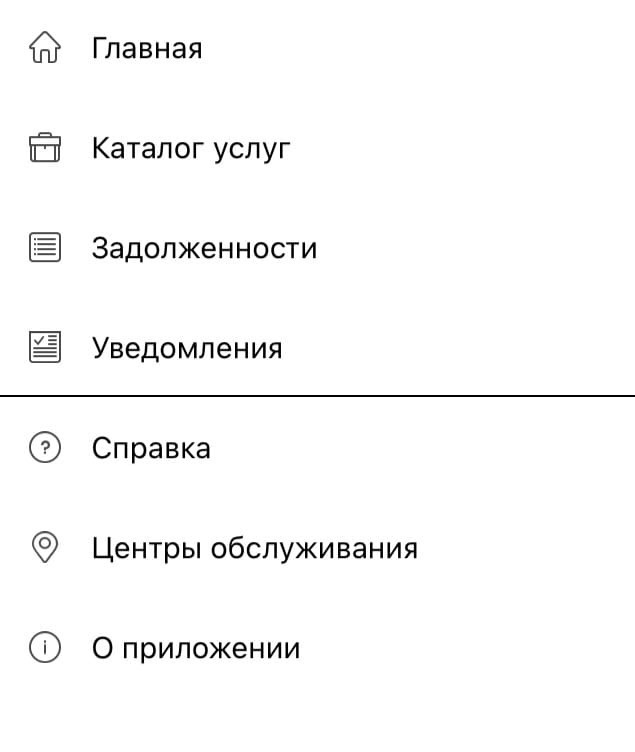

# GOSUSLUGI
Это репозиторий команды **RUSSKIE** для выполнения первой практической работы по предмету ТиВПО

Выбранное програмное обеспечение: [**Госуслуги**](https://www.gosuslugi.ru/help/mobile)

Состав команды: [Артём Долгополов](https://github.com/artemdol25), [Трапизонян Рафик](https://github.com/trapizonyan).

## Оглавление

1. [Краткое описание выбранного ПО](#Краткое-описание-выбранного-ПО)
2. [Функциональная спецификация](#Функциональная-спецификация)
3. [Диаграмма вариантов использования](#Диаграмма-вариантов-использования)
4. [Баги](#Баги)

## Краткое описание выбранного ПО

«Портал госуда́рственных и муниципальных услуг Российской Федерации» (Единый портал госуслуг, ЕПГУ, кратко — Госуслуги) — справочно-информационный интернет-портал. 
Обеспечивает доступ физических и юридических лиц к сведениям о государственных и муниципальных услугах в Российской Федерации — России, государственных функциях по контролю и надзору, об услугах государственных и муниципальных учреждений, об услугах организаций, участвующих в предоставлении государственных и муниципальных услуг, а также предоставление в электронной форме государственных и муниципальных услуг. 
Все услуги, размещенные на портале, соотнесены с конкретным регионом России: место получения услуги определяет, как наличие самой услуги, так и условия её предоставления.

## Функциональная спецификация

На портале «Госуслуги»  размещена справочная информация для физических и юридических лиц о порядке оказания госуслуг, в том числе — в электронном виде, организован поиск по тематике, ведомству, жизненной ситуации, представлены образцы документов, ссылки на сервисы госучреждений и ведомств.

Кроме сайта, у портала госуслуг есть мобильное приложение. Это помощник, который помогает зарегистрироваться на портале, отслеживать статус обращений, вовремя узнавать о новых штрафах. Если вы установите приложение и настроите уведомления, приложение сразу будет сообщать вам о новом штрафе, чтобы вы его не пропустили.

Взаимодействие пользователя с основными функциями приложения осуществляется с помощью специального меню, изображенного на рисунке ниже.

## Диаграмма вариантов использования

## Баги

### Неактивные иконки соц. сетей

В разделе услуги "Получение паспорта гражданина Российской Федерации" снизу присутствуют иконки для возможности поделиться данной услугой в соц. сетях, при нажатии на них ничего не происходит.

### Некорректная работа сброса кода доступа

На экране ввода кода доступа есть ссылка, по нажатию на которую есть возможность сбросить текущий код доступа, однако при нажатии на неё пользователя выкидывает с аккаунта без возможности вернуться назад.

### Сброс загруженной фотографии

В настройках профиля есть возможность загрузить фотографию, которая будет отображаться на аватарке профиля, однако после сохранения фотографии и последующего обновления приложения фотография может либо пропасть, либо отображаться по-старому.

### Ненужное открытие браузера

При нажатии на некоторые кнопки пользователя переводит в браузерную версию госуслуг, хотя при этом тот же самый функционал доступен в самом приложении.

### Некорректное отображение активных элементов

Иногда возможно неправильное расположение активных элементов на страницах - они могут "съезжать" и отображаться не так как должны.
